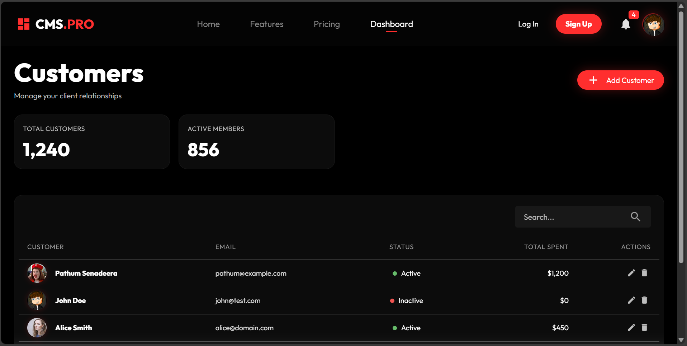
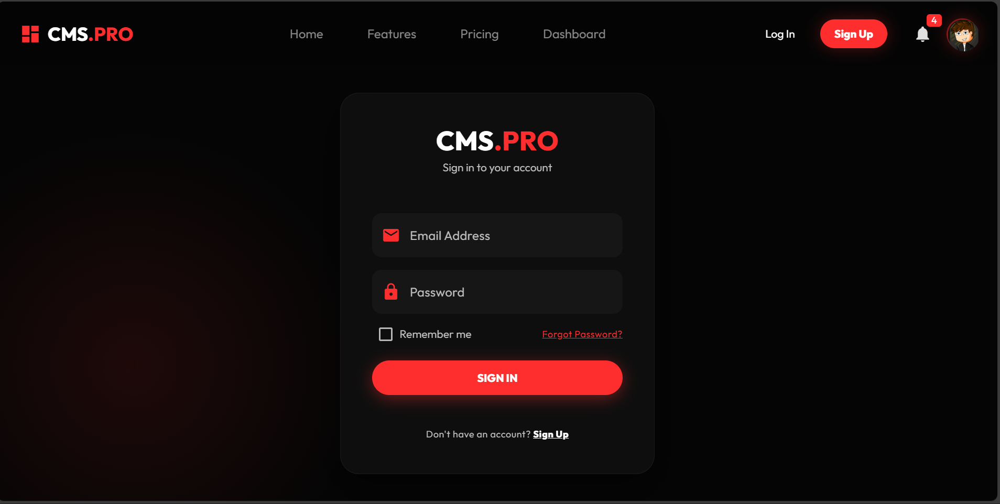

# CMS PRO - Customer Management System


A modern, high-performance Customer Management System built with **Vue 3** and **Quasar Framework**. features a premium **Black & Red** aesthetic ("Cyber Dark" theme), animated interactions, and a fully responsive design.

## 🚀 Features

### 🌐 Website / Landing Page

- **Hero Section**: Dynamic **Tech Marquee** with running images and 3D glassmorphism effects.
- **Features Grid**: Modern glass cards detailing platform capabilities.
- **Pricing**: Interactive pricing and subscription tiers.
- **Authentication**: Custom **Login** and **Signup** pages with neon glow effects.

### 📊 Dashboard & App

- **Overview**: Real-time stats, revenue charts, and recent activity feed.
- **Customer Management**: Advanced data table with search, status filters, and user avatars.
- **Settings**: User profile management and app configuration.
- **Dark Mode**: Native dark theme optimized for visual comfort and style.

## 🛠 Tech Stack

- **Framework**: [Quasar (Vue 3)](https://quasar.dev/)
- **Build Tool**: Vite
- **Styling**: SCSS / Sass
- **Icons**: Material Icons
- **Animations**: CSS Keyframes & Animate.css (via Quasar)

## 📸 Screenshots

|                     Landing Page                     |                   Dashboard                    |
| :--------------------------------------------------: | :--------------------------------------------: |
|  |  |

|               Login Page               |                 Customer List                  |
| :------------------------------------: | :--------------------------------------------: |
|  |  |

> _Note: Please add `dashboard.png`, `login.png`, and `customers.png` to the `public/screenshots` folder to update these images._

## 🏁 Getting Started

### Prerequisites

- Node.js (v16+)
- NPM or Yarn

### Installation

```bash
# Install dependencies
npm install
```

### Development

```bash
# Start the app in development mode (hot-reload)
quasar dev
```

### Build

```bash
# Build for production
quasar build
```

## 🎨 Theme Configuration

The project uses a custom color palette defined in `src/css/quasar.variables.scss`:

- **Primary Red**: `#FF2E2E`
- **Dark Background**: `#050505`
- **Glass Effect**: `rgba(20, 20, 20, 0.6)`

## 📄 License

This project is licensed under the MIT License.
